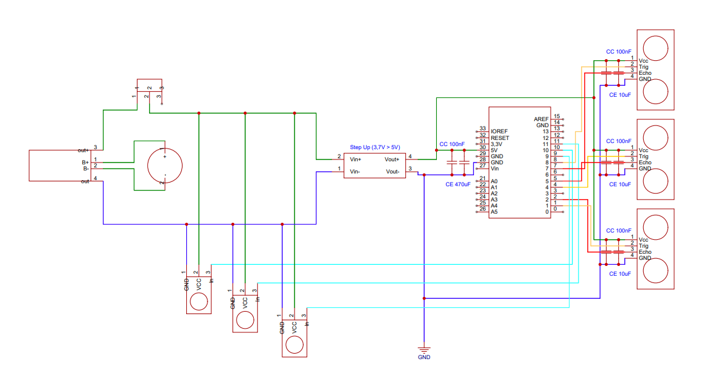
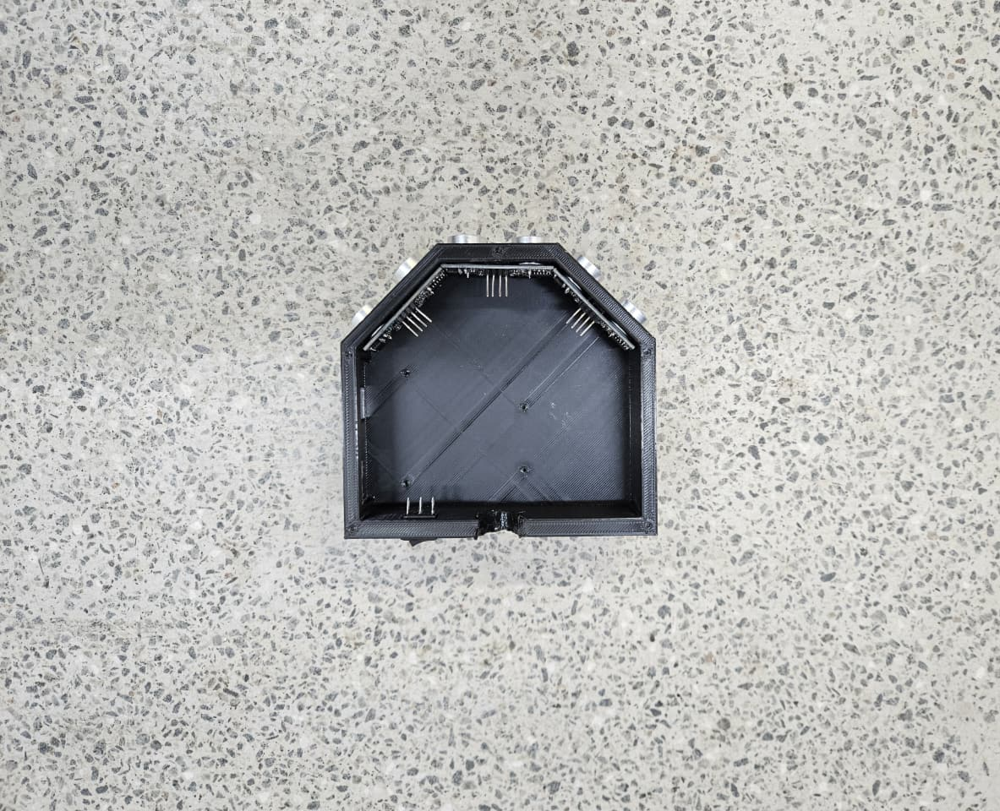
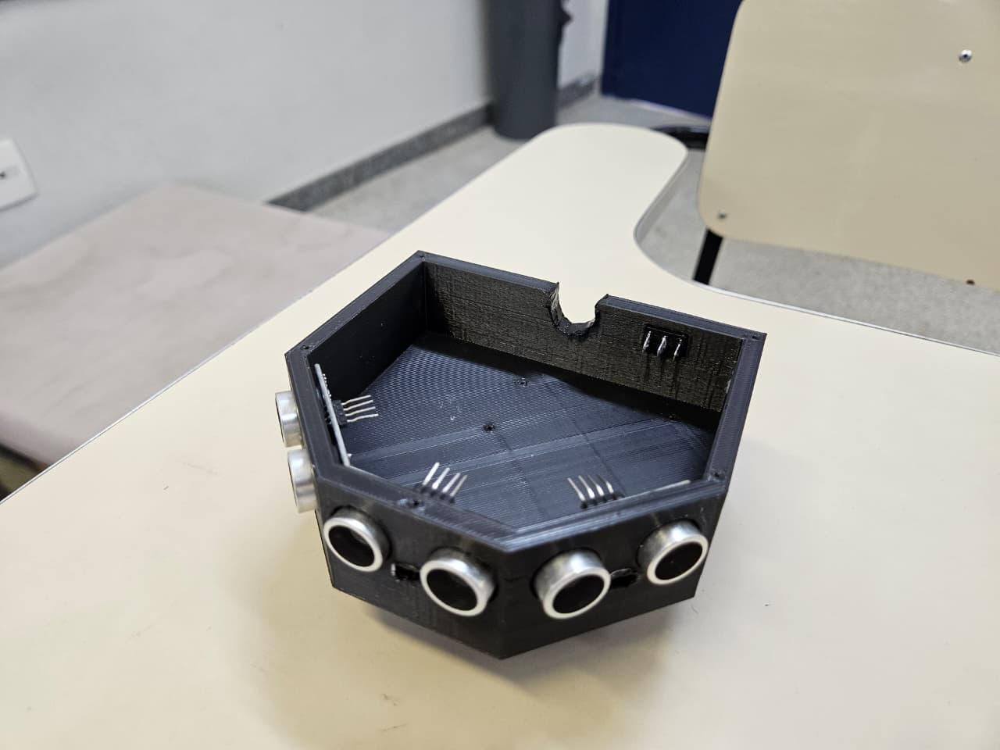
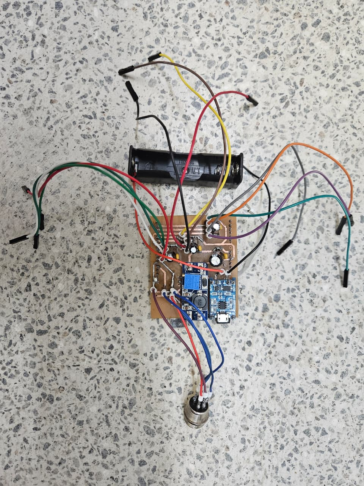
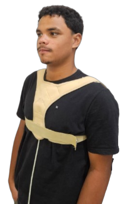
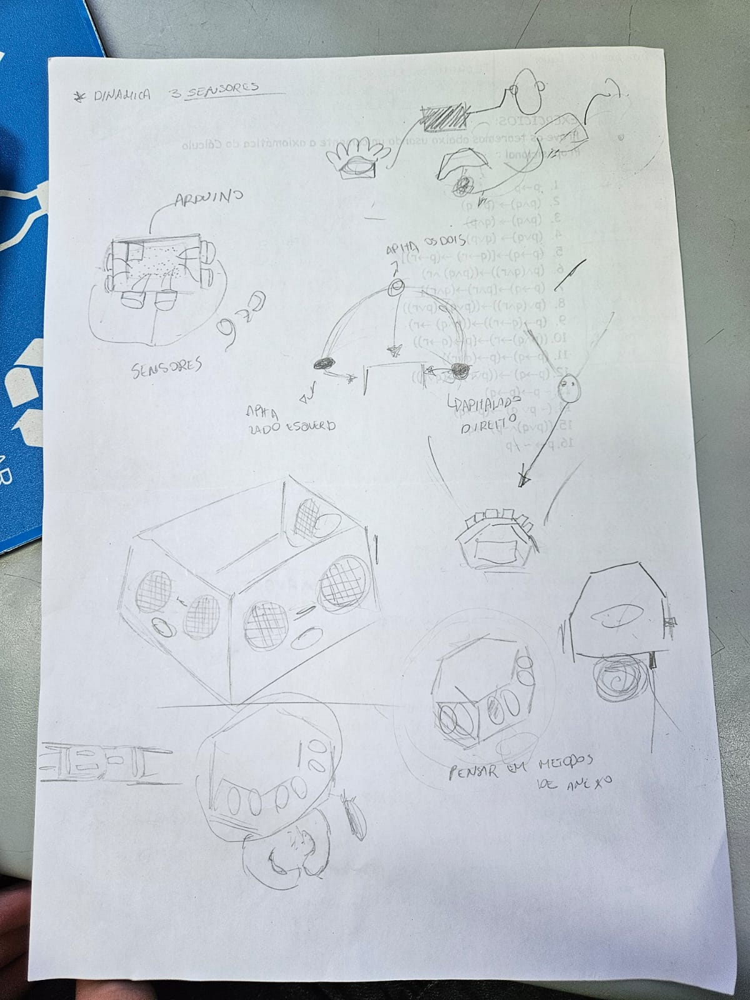
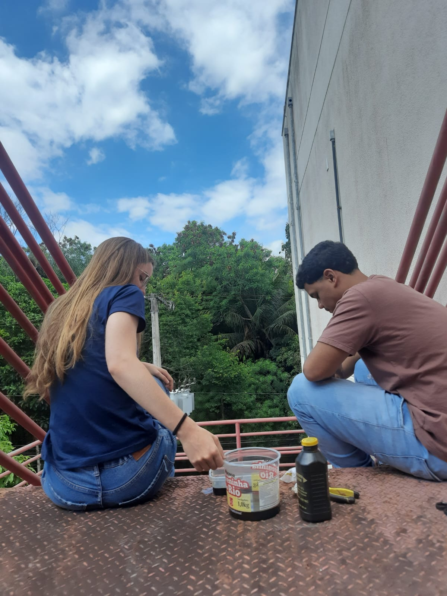
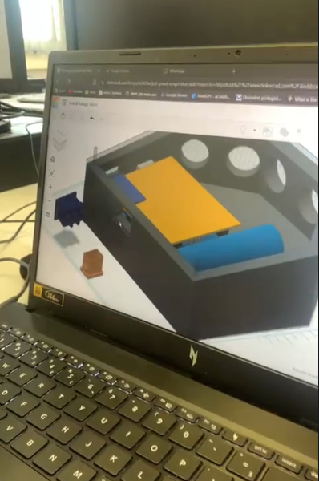

# Ecolocalizador Tátil para Bicicletas Tandem

Dispositivo de assistência baseado em **feedback tátil** para aumentar a **segurança**, a **confiança** e a **autonomia** de pessoas com deficiência visual na condução de bicicletas tandem.

> Projeto desenvolvido na disciplina **Projeto Integrado à Computação I** para a **Mostra de Computação da UFES**.


---


## 📌 Contexto e Motivação

A percepção do ambiente não depende exclusivamente da visão. Casos como o de **Ben Underwood** demonstram que outros sentidos podem ser explorados para navegação espacial.

<p align="center">
  <a href="https://www.youtube.com/watch?v=pt5yYK_4Rjo">
    
  </a>
</p>
<p align="center">
▶️ Clique na imagem para assistir no YouTube
</p>


Inspirados por essa ideia e por iniciativas como o projeto **Pedal Inclusão**, que utiliza bicicletas tandem para permitir que pessoas com deficiência visual pratiquem o ciclismo, tivemos contato direto com os desafios e possibilidades dessa experiência.

Durante um desses eventos, observamos um participante com deficiência visual conduzir a bicicleta apenas com orientações verbais de sua dupla. A experiência evidenciou o potencial da atividade, mas também deixou claro que a condução exige um alto nível de confiança e depende fortemente do ciclista enxergante.

A partir dessa vivência, surgiu a necessidade de pensar em uma **solução técnica** que aumentasse a sensação de segurança e encorajasse mais pessoas com deficiência visual a assumir a condução da bicicleta, tornando a atividade mais inclusiva.

---

## 🎯 Objetivos do Projeto

-  Aumentar a segurança do ciclista com deficiência visual durante a condução da bicicleta 
- Reduzir a dependência exclusiva de comandos verbais
- Fornecer percepção espacial por meio de feedback tátil
- Tornar a condução mais acessível e o esporte mais inclusivo

---

## 🧠 Visão Geral do Sistema

O sistema é composto por dois módulos principais:

- **Central no guidão da bicicleta**, responsável pela detecção de obstáculos
- **Colete tátil**, responsável por transmitir informações espaciais ao ciclista por meio da vibração

A comunicação entre esses módulos permite que a presença e a direção de obstáculos sejam percebidas.



---

## 🏗️ Arquitetura do Sistema

### 🔹 Central (Guidão)

A central é responsável pela leitura do ambiente à frente da bicicleta.

#### Componentes principais:
###### Arduino UNO
- Contém o algoritmo que converte a distância medida em intensidade de vibração, configuráveis por meio de código
```c++
...
// Dispara o pulso ultrassônico
digitalWrite(trigPin, LOW);
delayMicroseconds(2);
digitalWrite(trigPin, HIGH);
delayMicroseconds(10);
digitalWrite(trigPin, LOW);

// Lê o retorno
long duracao = pulseIn(echoPin, HIGH);
int distancia = duracao * 0.034 / 2;

// Calcula a Intensidade 
int pwm = 0;

if (distancia == 0 || distancia > DISTANCIA_MAX) {
  pwm = 0; // Desligado
} 
else if (distancia < DISTANCIA_MIN) {
  pwm = 255; // Vibração Máxima
} 
else {
  // Quanto mais perto, mais forte
  pwm = map(distancia, DISTANCIA_MIN, DISTANCIA_MAX, 255, 0);
}

// Aciona o Motor
analogWrite(motorPin, pwm);
...
```

###### 3 sensores ultrassônicos (HC-SR04)
- Dispostos em três faces frontais do chassi angulados em **45º** entre si
Tem um alcance de até 3 metros
- Estão posicionados no guidão, cobrindo aproximadamente **120°** à frente da bicicleta.
<table>
  <tr>
    <td>
      
    </td>
    <td>
      
  </tr>
</table>

###### Alimentação dedicada
- Bateria 3.7v 18650 recarregável
- Módulo Tp4056 para recarga

Esses componentes são centralizados em uma placa PCB:
<table>
  <tr>
    <td>
      
    </td>
    <td>
      
  </tr>
</table>

---


### 🔹 Colete Tátil


O colete é responsável por fornecer o feedback sensorial ao ciclista.


##### Componentes principais:
- 3 motores de vibração
- PCB dedicada


- Estrutura vestível (colete)

##### Os motores estão posicionados:
- Um no centro do peito
- Um em cada ombro

---

## 🔄 Mapeamento Sensor → Vibração

A informação captada pelos sensores é convertida em padrões de vibração, indicando a direção do obstáculo.

| Sensor | Posição no guidão | Motor ativado | Indicação |
|------|-------------------|---------------|-----------|
| Sensor esquerdo | Esquerda | Ombro esquerdo | Obstáculo à esquerda |
| Sensor central | Centro | Peito | Obstáculo frontal |
| Sensor direito | Direita | Ombro direito | Obstáculo à direita |

---

## 🧩 Componentes Utilizados

| Componente | Quantidade | Função |
|----------|------------|--------|
| Arduino | 1 | Processamento dos dados |
| Sensor ultrassônico HC-SR04| 3 | Detecção de obstáculos |
| Motor de vibração | 3 | Feedback tátil |
| PCB personalizada | 2 | Integração do sistema |
| Estrutura do colete | 1 | Fixação dos motores |
| Cabos e conectores | Diversos | Interligação |

---

## 🛠️ Processo de Desenvolvimento

#### O desenvolvimento do projeto passou pelas seguintes etapas:

- Levantamento do problema a partir de vivência prática
- Idealização do aparelho
- Levantamento de componentes necessários
- Prototipação inicial
- Projeto e confecção das PCBs
- Modelagem e impressão 3D
- Montagem dos módulos
- Testes funcionais do sistema

<table>
  <tr>
    <td>
      
    </td>
    <td>
      
    </td>
  </tr>
</table>
<table>
    <td>
      
    </td>
    <td>
      
    </td>
  </tr>
</table>

---

## 📊 Resultados e Limitações

### Resultados
- Detecção de obstáculos em tempo real
- Feedback tátil claro e direcional
- Integração confortável ao corpo do usuário

### Limitações
- Sistema ainda em fase de protótipo
- Testes limitados a ambientes controlados
- Necessidade de testes com usuários finais

---

## 🔧 Como Reproduzir o Projeto

- Os esquemáticos estão disponíveis em `/schematics`
- Os modelos para impressão em `/models3D`
- Os arquivos de PCB estão disponíveis em `/pcb`
- O código-fonte está disponível na pasta `/src`
- As imagens e diagramas estão em `/imagens`

---

## 👥 Equipe e Agradecimentos

Nossa equipe é composta por: André Luiz Mendes Siqueira de Freitas, Anna Raquel Sandrini, Arthur Manelli, Caetano Zandonade e Daniela Pimentel

<h4 align="center">  
    Agradecimentos especiais

</h4>

<table align="center" width="100%">
  <tr>
    <td align="center" width="50%">
      Ao projeto <strong>Pedal Inclusão</strong><br><br>
      A equipe de robótica da UFES: <strong>Erus</strong>
    </td>
    <td align="center" width="50%">
      Ao integrante do Vitória Baja:<br>
      <strong>Arthur Ferreira</strong><br><br>
      À professora, <strong>Mariana Lyra</strong>, que nos auxiliou a fazer a placa PCB<br><br>
      Ao professor da disciplina, <strong>Jadir</strong>
    </td>
  </tr>
</table>
